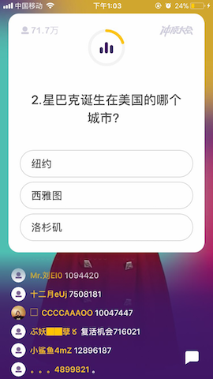
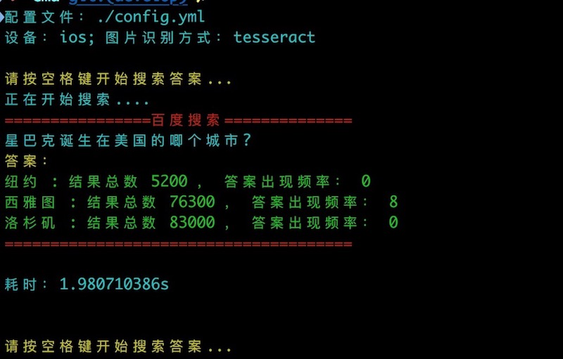

# 答题神器

《冲顶大会》，《百万英雄》等答题游戏的答题神器，顺利吃鸡！

通过抓取手机屏幕截图经过文字识别，结合搜索引擎给出一个参考值。



分析结果：



**结果说明：**

- 结果数：通过题目+答案的搜索形式在搜索引擎中的结果数量

- 答案出现频率：通过搜索题目，答案在第一页结果中出现的频率

结果并不是100%的，只给出一个参考值，还需用户自己判断。理论上可支持多款APP，只需要修改`config.yml`中的题目和答案的截取位置即可。


## 编译安装

安装go环境，执行 `make build` 生成`qanswer`可执行文件。

### 配置文件

默认为`./config.yml`文件，也可通过`-config`参数指定自定义路径。

执行`qanswer`时，默认读取当前目录下的`config.yml`配置文件。

各种答题类APP以及适配机型的配置：[机型配置](./docs)

**配置参数说明：**

```
# 是否开始调试模式
debug: false
# 对应的设备类型：ios or android
device: ios
# 使用的ocr工具：baidu or tesseract
ocr_type: baidu
# ios 设备连接wda的地址
wda_address: '127.0.0.1:8100'
# 截取题目的位置 ：
question_x: 30
question_y: 310
question_w: 650
question_h: 135
# 截取答案的位置
answer_x: 30
answer_y: 500
answer_w: 680
answer_h: 370
#当选用baidu ocr时，需要执行api_key和secret_key
baidu_api_key: "xxx...."
baidu_secret_key: "xxx...."

```

### iOS
`device: ios`


- 安装WDA ：[iOS 真机如何安装 WebDriverAgent](https://testerhome.com/topics/7220)
- 编译得到`qanswer`文件
- 根据设备尺寸以及答题APP，修改题目和答案截取位置参数，并且指定`wda_address` WDA 连接地址
- 按空格键开始


### Android
`device: android`

##### 安装ADB

安装完后插入安卓设备且安卓已打开 USB 调试模式，终端输入 `adb devices `，显示设备号则表示成功。

```
List of devices attached
MWUBB17518200733	device
```


## 百度ocr
`ocr_type: baidu`

如果使用[百度ocr](https://cloud.baidu.com/product/ocr.html)，则需要预先申请api key 和secret key ，并且免费的额度有限

## tesseract
`ocr_type: tesseract`

安装tesseract以及简体中文包。

以mac:为例

```
brew install tesseract
cd /usr/local/Cellar/tesseract/{version}/share/tessdata
wget https://github.com/tesseract-ocr/tessdata/raw/master/chi_sim.traineddata
```

其他系统的安装说明：https://github.com/tesseract-ocr/tesseract/wiki


### TODO:

- 不同机型，不同答题app的配置参数
- 支持google搜索